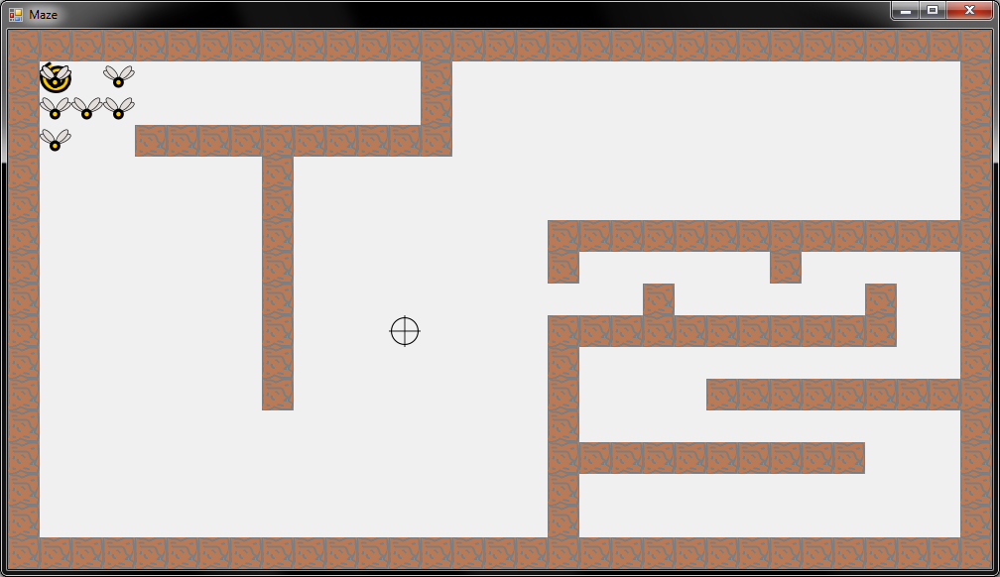

* [К оглавлению задачника](https://github.com/urfu-code/cs101-main)
* [Кодекс разработчика](https://docs.google.com/document/d/1w8C1VyDPh9_1DaGD6oDJWmHw8V6cWrr469CgMiLGmdE/edit#)

# Задачи на поиск в ширину

## Flies (2 балла)

Откройте solution mazes.sln. Вас интересует проект 01-flies.

Мухи периодически рождаются в своём уголочке и должны хотят лететь к вашему курсору.

Сейчас у них это не очень получается. Реализуйте в классе PathFinder алгоритм поиска кратчайшего пути до текущего положения курсора.

## Атака тёмной крепости (2 балла)

В [контесте](http://acm.timus.ru/auth.aspx?source=monitor.aspx%3fid=204) появилась (или вот-вот появится) ещё одна задача с тимуса — [1643](http://acm.timus.ru/problem.aspx?space=1&num=1643).

В проекте есть заготовка для её решения и ещё один проект, визуализирующий её решение.

Используйте визуализатор для отладки вашего решения. 
Входные данные визуализатор читает из файла input.txt в директории запуска проекта (он туда копируется из проекта при каждой сборке).

Для того, чтобы заработал визуализатор, в задаче, естественно, необходимо вычислить ещё и сам план передвижения войск.

Не забывайте проверять стиль написанного вами кода с помощью [Code Stylist](https://labs.skbkontur.ru/cleancode).

# Подсказки

**Внимание!** 

Вы не обязаны решать задачи в точности следуя указаниям ниже.
Более того, будет лучше, если у вас получится решить задачу без использования этих подсказок.

Рекомендуется пользоваться этим подсказками, только если совсем не можете самостоятельно придумать как решать задачу.

Впрочем, если вы уже решили задачу, будет небесполезно подсказки все же прочитать.
Возможно, они откроют вам какой-то новый взгляд на задачу.

↓

↓

↓

↓

↓

↓

↓

↓

↓

↓

Для задачи восстановления кратчайшего пути удобно для посещённой каждой точки сохранять ещё и то, откуда в неё пришли.

To be continued...
