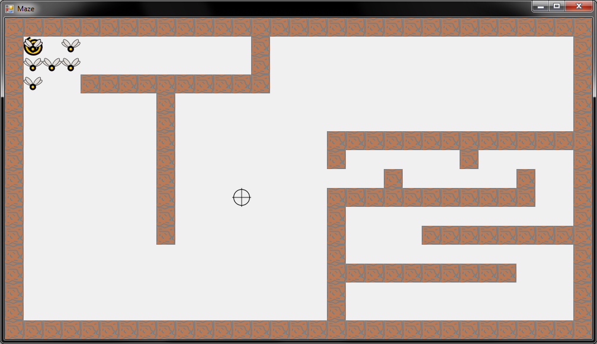

* [К оглавлению задачника](https://github.com/urfu-code/cs101-main)
* [Кодекс разработчика](https://docs.google.com/document/d/1w8C1VyDPh9_1DaGD6oDJWmHw8V6cWrr469CgMiLGmdE/edit#)

# Задачи на поиск в ширину

## Flies (2 балла)

Откройте solution mazes.sln. Вас интересует проект 01-flies.

Мухи периодически рождаются в своём уголочке и должны хотят лететь к вашему курсору.

Сейчас у них это не очень получается. Реализуйте в классе PathFinder алгоритм поиска кратчайшего пути до текущего положения курсора.

## Атака тёмной крепости (2 балла)

В [контесте](http://acm.timus.ru/auth.aspx?source=monitor.aspx%3fid=204) появилась (или вот-вот появится) ещё одна задача с тимуса — [1643](http://acm.timus.ru/problem.aspx?space=1&num=1643).

В проекте есть заготовка для её решения и ещё один проект, визуализирующий её решение.

Используйте визуализатор для отладки вашего решения.
Входные данные визуализатор читает из файла input.txt в директории запуска проекта (он туда копируется из проекта при каждой сборке).

Для того, чтобы заработал визуализатор, в задаче, естественно, необходимо вычислить ещё и сам план передвижения войск.

Не забывайте проверять стиль написанного вами кода с помощью [Code Stylist](https://labs.skbkontur.ru/cleancode).

# Подсказки

**Внимание!** 

Вы не обязаны решать задачи в точности следуя указаниям ниже.
Более того, будет лучше, если у вас получится решить задачу без использования этих подсказок.

Рекомендуется пользоваться этим подсказками, только если совсем не можете самостоятельно придумать как решать задачу.

Впрочем, если вы уже решили задачу, будет небесполезно подсказки все же прочитать.
Возможно, они откроют вам какой-то новый взгляд на задачу.

↓

↓

↓

↓

↓

↓

↓

↓

↓

↓

Для задачи восстановления кратчайшего пути удобно для каждой посещённой клетки сохранять ещё ту клетку из которой в неё перешел поиск в ширину. Используя эту информацию вы сможете восстановить путь, правда в обратном порядке.

## Flies

Пример реализации обхода лабиринта в ширину был на лекции.

Попробуйте реализовать GetNeighbours без единого цикла с помощью Linq. Вам подандобятся методы Where, Select, Concat.

Можно искать путь от мухи к цели, а можно наоборот. Подумайте, что из этого вам будет удобнее. Имейте в виду, что вам не нужен весь путь, а нужен только первый шаг мухи.

## Атака тёмной крепости

Обход в ширину в результате обработки очередной клетки может вычислить длину кратчайшего пути до этой клетки, а также клетку предшествующую данной в кратчайшем пути.

Если вы сделаете обход в ширину дважды — для армии Джелу и для армии Катерины, то для каждой клетки вы узнаете когда туда может подойти каждая из армий. После этого, вам уже будет несложно выбрать наилучшую клетку, из которой следующим ходом можно будет атаковать крепость.

Одна из сложностей этой задачи — телепорты. Проход через них не занимает времени. Поэтому можно считать, что любая клетка телепорта соседствует со всеми клетками, соседними со всеми телепотрами того же типа.

Чтобы скрыть эту сложность от поиска в ширину, стоит выделить в отдельную функцию вычисление всех клеток, в которые можно перейти из данной (аналог GetNeighbours из прошлой задачи).

### Возможный Time limit

Если вы получаете Time limit на тесте с номером 27 или больше — это значит вы неэффективно обрабатываете ситуацию с большим количеством телепортов. Представьте себе мир, в котором все заполенено телепортом одного типа. Эффективно ли работает ваша программа на таком мире? Подумайте самостоятельно над оптимизацией перед тем как читать следующий абзац.

Все телепорты одного типа можно считать одной и той же клеткой. То есть если вы в процессе обхода в ширину пометили один из телепортов как использованный, то все остальные телепорты того же типа тоже можно помечать как использованные. Если вы вычислили длину кратчайшего пути до телепорта, то до всех остальных телепортов того же типа длина пути ровно та же.
Эта идея сильно сократит обход.
